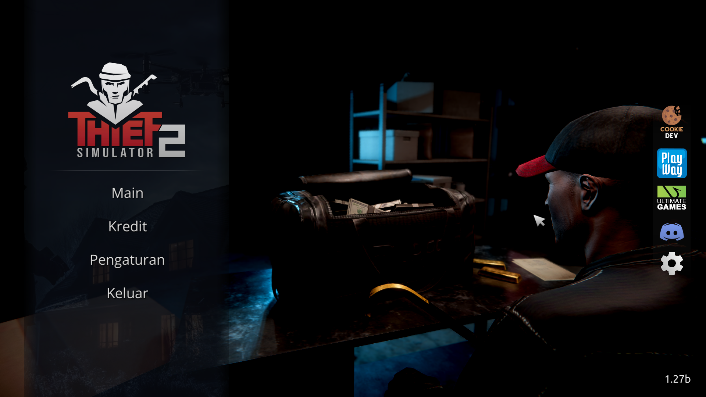
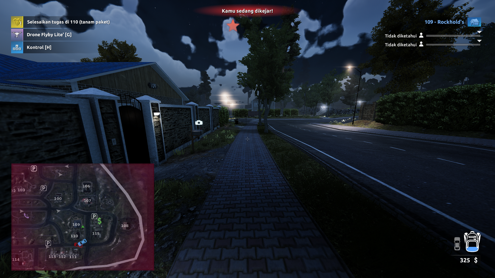
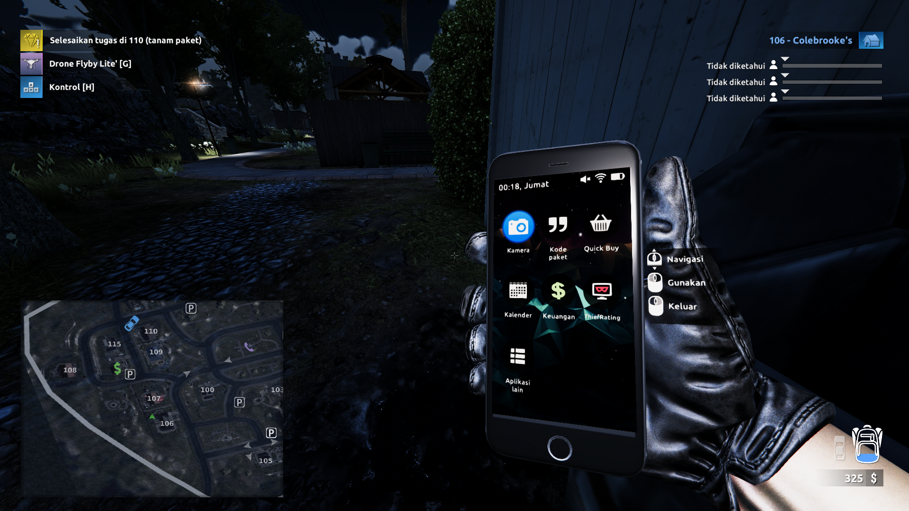
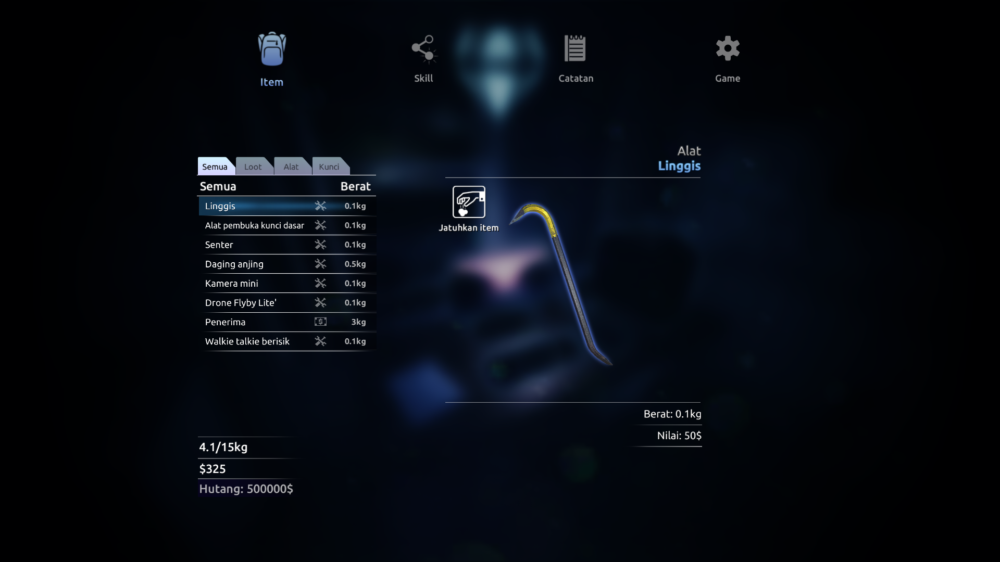
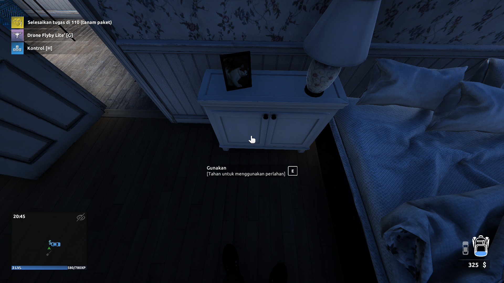
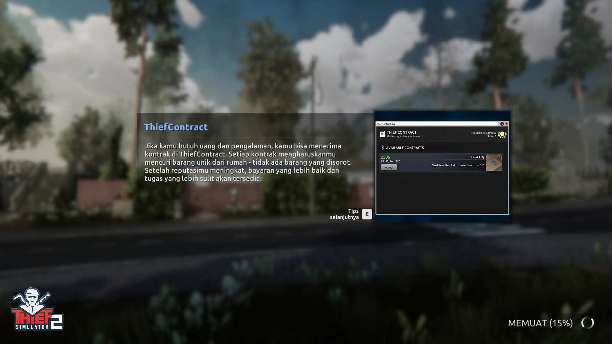
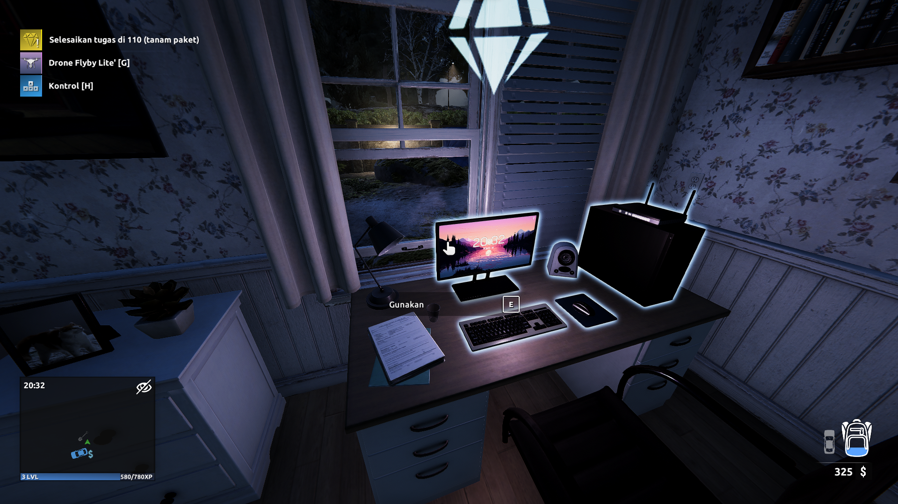
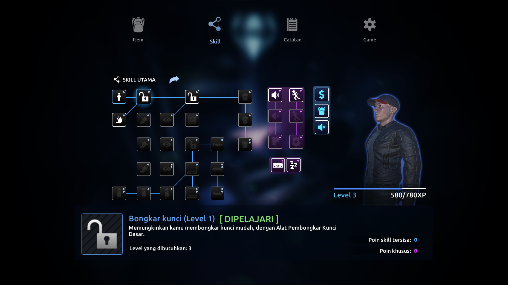
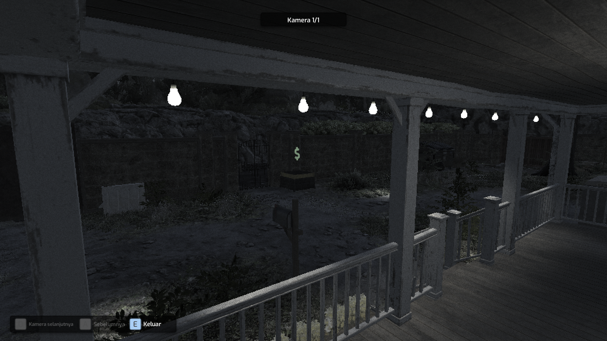
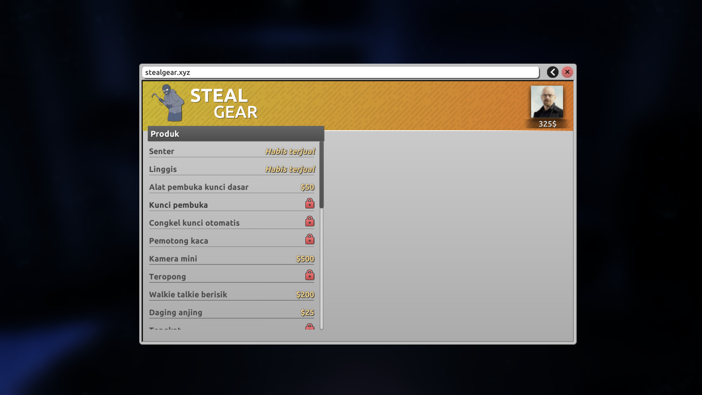

<div align="center">

# 🎮 Thief Simulator 2 - Indonesian Translation

*Mod terjemahan bahasa Indonesia untuk Thief Simulator 2*

[](https://github.com/shiestapoi/Thief-Simulator-2-Bahasa-Indonesia-Modded/releases)
[](https://github.com/shiestapoi/Thief-Simulator-2-Bahasa-Indonesia-Modded/releases)
[](LICENSE)
[]()

[📥 Download](#-instalasi) • [🖼️ Screenshots](#-preview-screenshot) • [🤝 Kontribusi](#-kontribusi) • [📋 Lisensi](#-lisensi)

</div>

---

## 📖 Tentang Proyek

Mod ini menyediakan **terjemahan bahasa Indonesia** untuk game Thief Simulator 2, memungkinkan pemain Indonesia untuk menikmati game dengan bahasa yang lebih familiar. Terjemahan dibuat menggunakan teknologi AI terdepan untuk memastikan kualitas dan konsistensi.

## 🚀 Instalasi

### Persyaratan Sistem
- ✅ Thief Simulator 2 versi **1.27b atau lebih rendah**
- ✅ Windows 7/8/10/11
- ✅ Steam, versi retail game, crack

### Langkah-langkah Instalasi

#### 1. 📁 Buka Direktori Game
```
C:\Program Files (x86)\Steam\steamapps\common\Thief Simulator 2\
```
*Atau klik kanan game di Steam → Properties → Local Files → Browse Local Files*

#### 2. 🗂️ Masuk ke Folder Data
Navigasi ke folder `Thief Simulator 2_Data` dan cari file `resources.assets`

#### 3. 💾 Backup File Asli
```bash
# Salin file asli sebagai backup
cp resources.assets resources.assets.backup
```

#### 4. 📥 Download File Terjemahan
**[📥 KLIK DOWNLOAD](https://github.com/shiestapoi/Thief-Simulator-2-Bahasa-Indonesia-Modded/releases/latest/download/resources.assets)**

Atau cek semua versi di **[🔗 Releases](https://github.com/shiestapoi/Thief-Simulator-2-Bahasa-Indonesia-Modded/releases)**

#### 5. 🔄 Replace File
Salin file `resources.assets` yang telah didownload ke folder `Thief Simulator 2_Data` dan ganti file yang ada

#### 6. ✅ Verifikasi
Jalankan game dan periksa apakah teks sudah berubah ke bahasa Indonesia

## 🖼️ Preview Screenshot

<div align="center">

### 🎮 Gameplay Screenshots

<table>
  <tr>
    <td></td>
    <td></td>
    <td></td>
  </tr>
  <tr>
    <td align="center"><em>Menu Utama</em></td>
    <td align="center"><em>Gameplay 1</em></td>
    <td align="center"><em>Gameplay 2</em></td>
  </tr>
</table>

<details>
<summary>📸 Lihat Screenshot Lainnya</summary>

<table>
  <tr>
    <td></td>
    <td></td>
    <td></td>
    <td></td>
  </tr>
  <tr>
    <td></td>
    <td></td>
    <td></td>
    <td></td>
  </tr>
</table>

</details>

</div>


## 🔧 Troubleshooting

<details>
<summary>❌ Game tidak bisa dimulai setelah instalasi</summary>

1. Restore file backup:
   ```cmd
   ren resources.assets.backup resources.assets
   ```
2. Pastikan versi game sesuai (≤ 1.27b)
3. Verifikasi integritas file game di Steam

</details>

<details>
<summary>🔤 Terjemahan tidak muncul</summary>

1. Periksa apakah file `resources.assets` telah diganti
2. Restart game sepenuhnya
3. Cek versi game di menu utama

</details>

<details>
<summary>✂️ Teks terpotong atau tidak sesuai</summary>

- Ini adalah keterbatasan dari terjemahan AI
- Laporkan masalah di [Issues](https://github.com/shiestapoi/Thief-Simulator-2-Bahasa-Indonesia-Modded/issues)
- Akan diperbaiki di update selanjutnya

</details>

## 🤝 Kontribusi

### 🐛 Melaporkan Bug
- Buat [Issue baru](https://github.com/shiestapoi/Thief-Simulator-2-Bahasa-Indonesia-Modded/issues/new)
- Sertakan screenshot dan deskripsi detail
- Mention versi game dan OS yang digunakan


### 💡 Saran & Ide
- Diskusi di [Discussions](https://github.com/shiestapoi/Thief-Simulator-2-Bahasa-Indonesia-Modded/discussions)
- Berikan feedback untuk peningkatan kualitas

### 🌟 Cara Lain Berkontribusi
- ⭐ Star repository ini
- 🔄 Share ke teman-teman gamer
- 📢 Review di Steam atau forum gaming

## 📊 Statistik Proyek

<div align="center">


**📈 Progress Terjemahan: 100%** | **🎯 Akurasi: ~95%** | **👥 Contributors: 5+**

</div>

## 📋 Lisensi

Proyek ini dilisensikan di bawah [MIT License](LICENSE) - lihat file LICENSE untuk detail lengkap.


## ⚠️ Disclaimer

- Mod ini dibuat untuk tujuan **edukasi dan hiburan**
- Penggunaan mod sepenuhnya menjadi **tanggung jawab pengguna**
- Developer tidak bertanggung jawab atas **kerusakan game atau data**
- Selalu lakukan **backup** sebelum instalasi
- Mod ini **tidak berafiliasi** dengan developer resmi game

---

<div align="center">

### 🎮 Selamat Bermain Thief Simulator 2 dalam Bahasa Indonesia! 🇮🇩

**Made with ❤️ by ShiestaPoi**

</div>